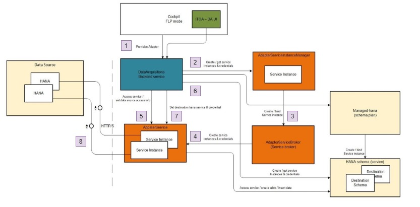

# Solution Design Demonstration

## Why this design
I would like to demonstrate my ability to learn, adopt company technology and well understand the design principle of adopted platform.

## Background and context of the solution design
This is a replatform and rearchitecure solution to move SAP ITOA into SAP Cloud Platform under SAP HANA toolings. 
SAP ITOA originated as a monolith on-premise product providing SAP HANA monitoring and operation capabilities. The whole product contains various parts, including:
* Monolith analytics application.
* Data Collector application
* etc

The scope of this design document is focusing on moving the data collector component as managed service to SAP cloud platform.

## Solution focus:
* serice scalability
* adoption of SAP Cloud platform, XSA technology and cloud managed service design principle.

## Outcome and impact
* A POC has been developed
* service scalbility confirmed
* multi-tanant support
* automate data collector provisioning

## Solution architect

* Orange, blue, and green boxes are the service / component we have to developed.
* Left light pink box: SAP HANA system / tenant to be monitored
* right light box: SAP Cloud platform HANA DB storage service

## Appendix:
* **Service broker framework**

Development of a service broker for most of the business services involves implementation of the Open Service Broker API. There are many common parts in this journey.  Hence, a reusable Node.js package is developed.  This will significantly reduce the effort to create a new service broker. 

Above solution adopts this framework and library to create AdapterServiceBroker.

* **Instance manager**

It is general concept and starting from the demand of support multi-tenance application. It currently is applied into HANA service, result as managed-hana.

Service instances are statically bound to an application at deployment time. However, multi-tenancy capable applications that leverage service instances for tenant separation (e.g. each tenant stores its data in a separate HDI container). Additional instances is created at runtime whenever a new tenant is added. To support this requirement, Application Managed Service Instances are made available by the Instance Manager (fka Instance Broker)

Above solution adopts this fraework to create its own Service Instance Manager

